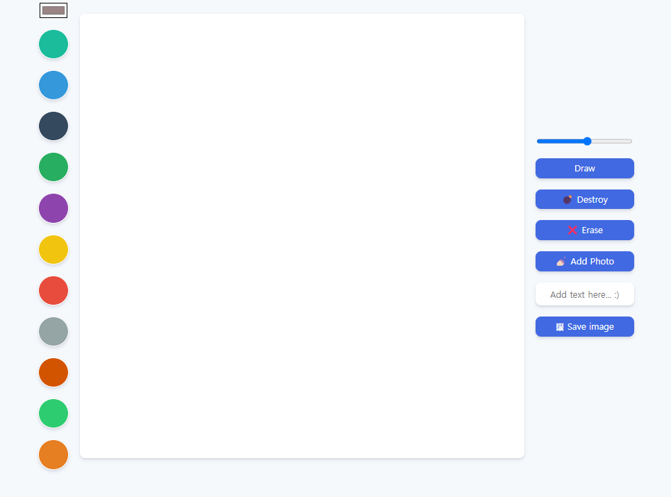
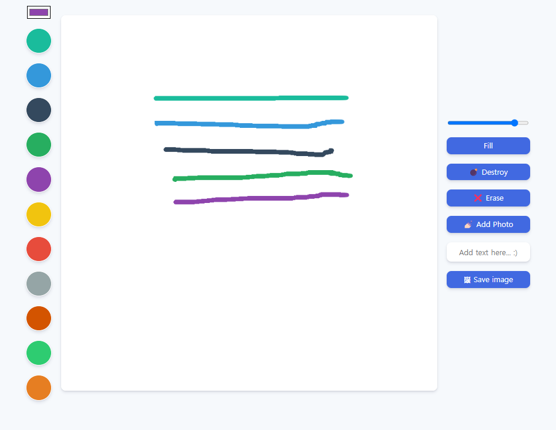
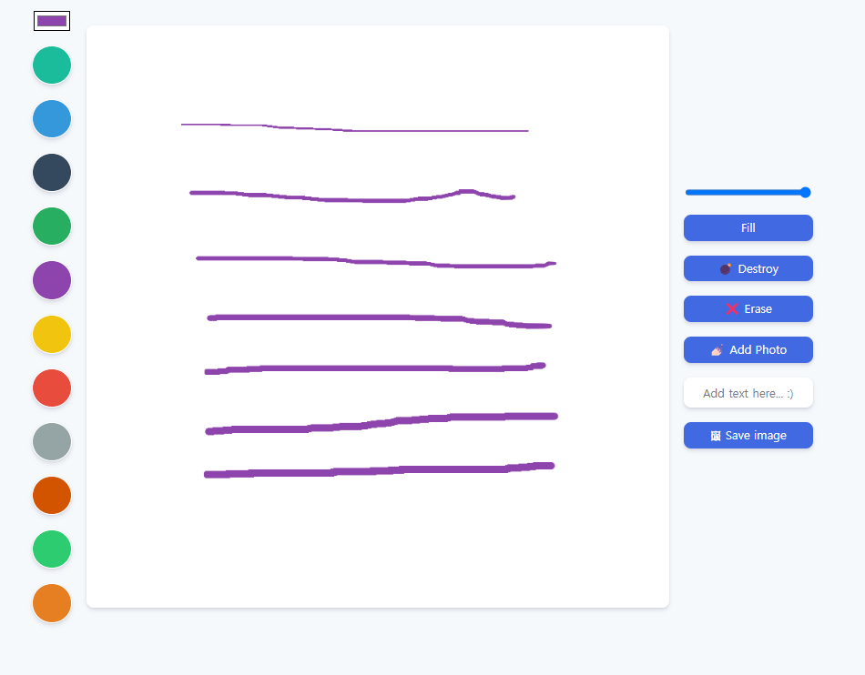
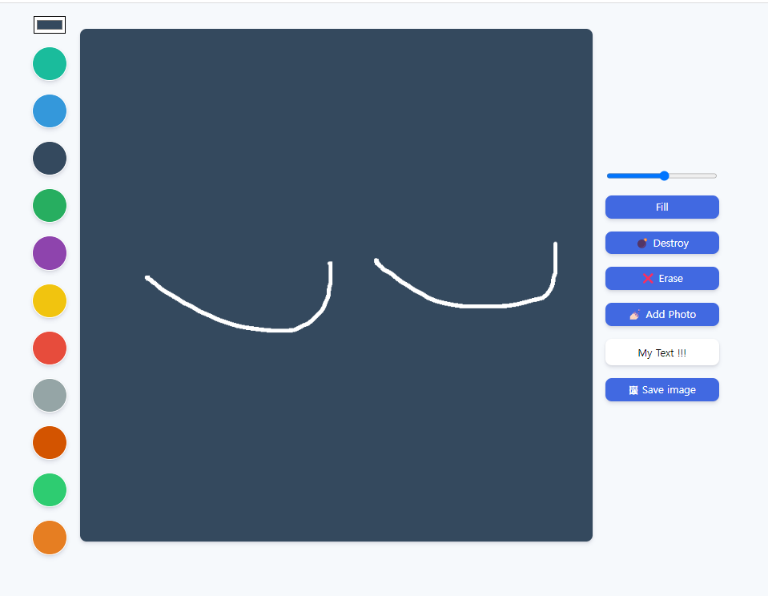
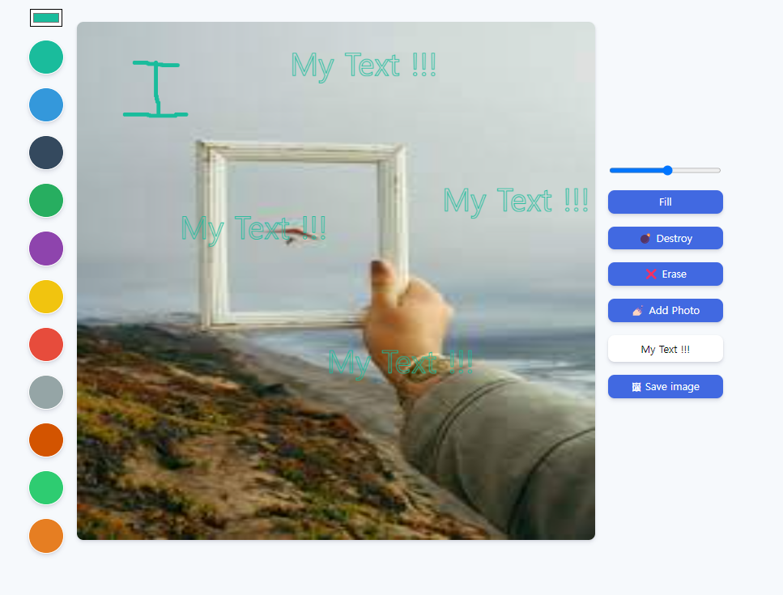
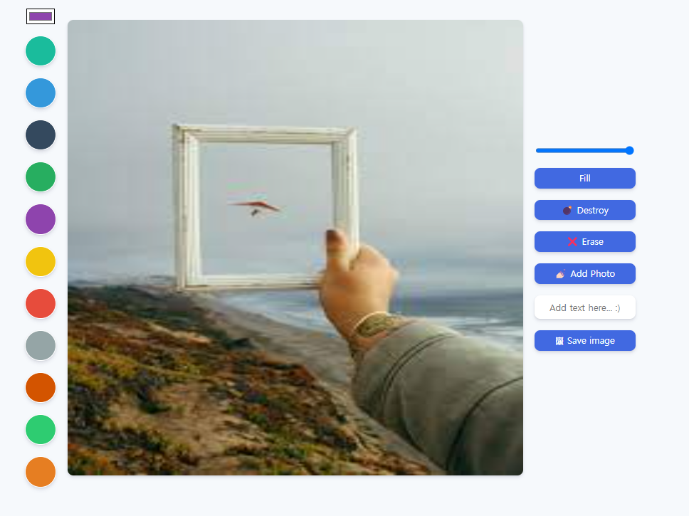

# 그림판 만들기
> JS를 이용하여 그림판을 만들어 봅니다.

## 사용 예제
클릭한 상태로 마우스를 이동하여 그림을 그립니다.   

좌측 색상을 클릭하여 사용할 수 있습니다.   

선 굵기를 선택할 수 있습니다.

Draw 와 Fill 버튼을 눌러 그리기와 채우기 모드를 사용할 수 있습니다.   
또한 Erase 를 눌러 지우기가 가능합니다.

Add Text here 에 원하는 텍스트를 입력하고 화면에서 더블클릭하여 텍스트를 추가할 수 있습니다.

Add Photo 를 통해 배경에 원하는 사진을 추가할 수 있습니다.   
또한 Save image를 통해 내가 그린것을 png 파일로 다운로드 받을 수 있습니다.

